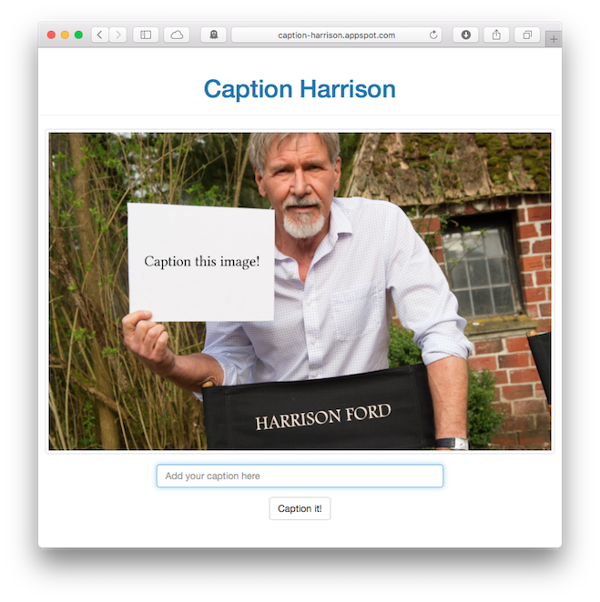
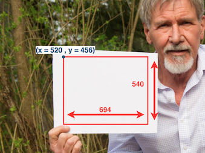

# Caption It! GAE project

Caption It! is a Google App Engine project written in Python that makes it easy to add captions to a chosen image, and share these. The captioned images are dynamically generated. 

A live example with a picture of Harrison Ford can be found [here](http://caption-harrison.appspot.com).

The project can be adjusted to support a different caption image.

## Some example captions
- [Luke, I am your father!](http://caption-harrison.appspot.com/caption?ck=ahJzfmNhcHRpb24taGFycmlzb25yFAsSB0NhcHRpb24YgICAgN6QgQoM)
- [I don't really care who shot first!](http://caption-harrison.appspot.com/caption?ck=ahJzfmNhcHRpb24taGFycmlzb25yFAsSB0NhcHRpb24YgICAgN6MkAoM)

## Things to change when choosing a different caption image

1. Change the template image `captionimage/caption.jpeg`.
2. In `base.html`, change the `title`and `h1` values.
3. Change the welcome image for the index page (`images/captionthis.jpeg`).
4. Change the 404 image (`images/404.jpeg`).
5. In `captionit.py`, change the caption area (in pixels), font size, and number of lines values on line  based on the new image.

	Example caption area values:
	
	

6. **Optionally:** change the font used by changing the value on line 86 of the `captionit.py` file.

## Acknowledgments
- This project uses the [Bootstrap framework](http://getbootstrap.com) for styling the web pages.
- The [Linux Libertine](http://www.dafont.com/linux-libertine.font) font is used (GPL license).

